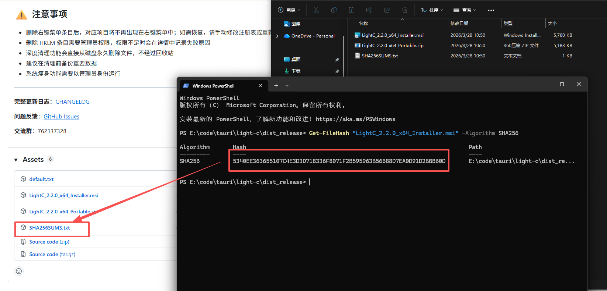
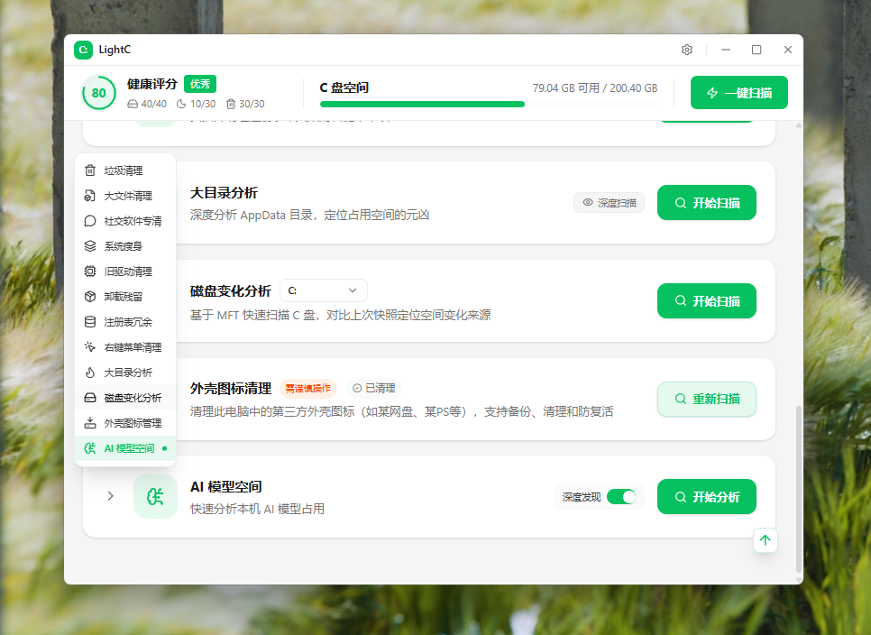
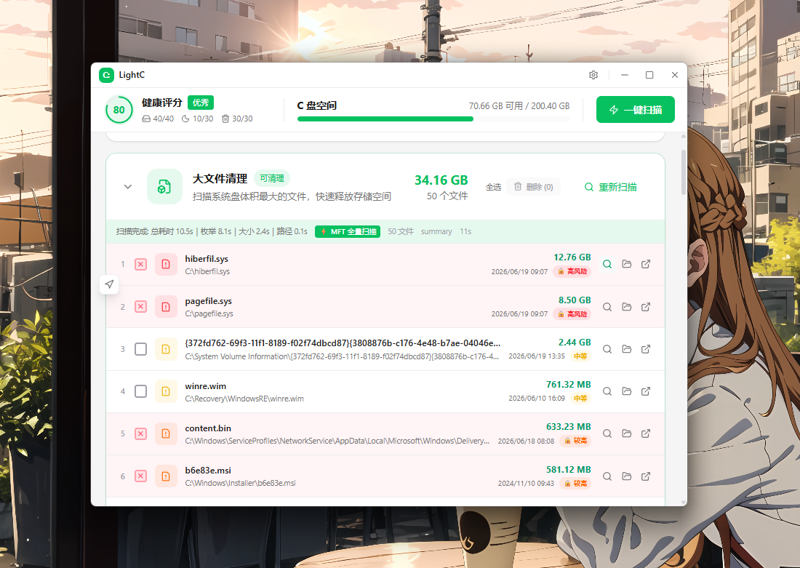
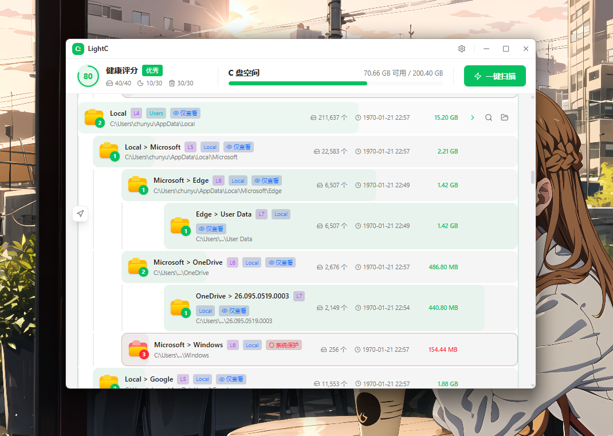
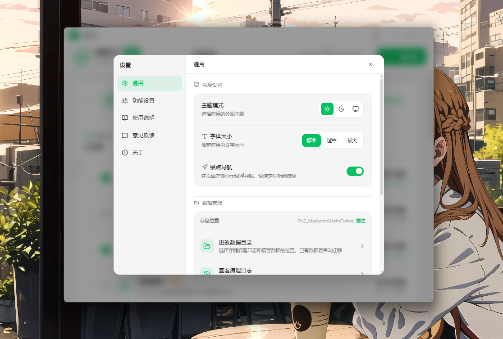

<p align="center">
  
</p>

<h1 align="center">LightC</h1>

<p align="center">
  <strong>轻量级 Windows C盘智能清理工具</strong>
</p>

<p align="center">
  
  
  
  
  
</p>

---


## ⚠️ 安全下载声明

> **请认准唯一官方发布渠道：[GitHub Releases](https://github.com/Chunyu33/light-c/releases)**
>
> 近期发现有第三方下载站分发非官方打包版本，**为了您的系统安全，请勿从非授权渠道下载**。

### 📥 官方下载渠道

| 渠道 | 链接 | 说明 |
|:-----|:-----|:-----|
| **GitHub Releases** | [https://github.com/Chunyu33/light-c/releases](https://github.com/Chunyu33/light-c/releases) | 唯一官方发布渠道 |
| **夸克网盘高速下载** | [https://pan.quark.cn/s/e698f3b9b4f9](https://pan.quark.cn/s/e698f3b9b4f9) | 作者分享，国内高速 |
| **作者哔哩哔哩主页** | [https://space.bilibili.com/387797235](https://space.bilibili.com/387797235?spm_id_from=333.1007.0.0) | 关注获取最新动态 |

### � 验证文件完整性

为确保下载的安装包未被篡改，请在安装前验证文件哈希值：

**PowerShell（推荐）**
```powershell
Get-FileHash .\文件名.msi -Algorithm SHA256
```

**CMD（命令提示符）**
```cmd
certutil -hashfile 文件名 SHA256
```

将计算结果与 [GitHub Releases](https://github.com/Chunyu33/light-c/releases) 页面公布的 SHA256 值对比，**完全一致**即为官方原版文件。

<p align="center">
  
</p>

---

## 📸 运行截图

<p align="center">
  
  
  
  
</p>

## ✨ 功能特性

### 🔍 一键扫描清理
- **10种垃圾分类**：Windows临时文件、系统缓存、浏览器缓存、回收站、Windows更新缓存、缩略图缓存、日志文件、内存转储、旧Windows安装、应用缓存
- **多线程并行扫描**：利用Rust的高性能并发能力，快速遍历文件系统
- **实时进度反馈**：扫描过程中实时显示当前分类和进度
- **虚拟列表优化**：大量文件列表也能流畅滚动

### � 大文件清理
- **智能扫描**：快速识别 C 盘中占用空间最大的文件
- **风险等级标识**：根据文件大小自动标记风险等级
- **一键定位**：支持打开文件所在目录或直接打开文件
- **批量选择删除**：勾选后一键清理，释放大量空间

### 💬 社交软件专清
- **多平台支持**：微信、QQ、钉钉、飞书、企业微信等主流社交软件
- **智能路径检测**：自动识别各软件的缓存目录（支持自定义安装路径）
- **分类管理**：图片视频、文件缓存、其他缓存分类展示
- **安全清理**：仅清理缓存文件，不影响聊天记录

### 🚀 系统瘦身（需管理员权限）
- **休眠文件管理**：一键关闭/开启休眠功能，释放与内存等量的空间（8-32GB）
- **系统组件清理**：调用 DISM 清理 WinSxS 组件存储中的冗余文件
- **虚拟内存优化**：检测分页文件位置，引导迁移到非系统盘
- **风险提示**：每项操作都有详细的功能说明和风险警告

### 🔬 大目录分析
- **语义识别技术**：深度分析 AppData 目录，智能识别占用空间最大的文件夹
- **元凶定位**：快速找出 C 盘空间的"罪魁祸首"，精准释放磁盘空间
- **风险标记**：自动标记程序缓存和潜在风险项，辅助决策
- **一键打开**：支持直接打开文件夹或在线搜索了解更多信息

### 🎯 深度卸载残留清理
- **模拟器残留检测**：支持主流安卓模拟器（**雷电、蓝叠、夜神、MuMu、MEmu、腾讯手游助手**等）的驱动级清理
- **虚拟磁盘扫描**：自动识别 `.vmdk`、`.vdi`、`.vhd` 等虚拟磁盘文件，这些文件通常占用数十GB空间
- **注册表深度扫描**：扫描 HKCU/HKLM Software 下的孤立注册表项和孤立驱动服务项
- **大文件高亮**：模拟器残留和大型文件以红色高亮显示，方便快速识别

### �️ 右键菜单清理
- **深度扫描注册表**：基于 Rust 高性能 winreg 扫描器，覆盖任意文件、文件夹、桌面背景、磁盘备山等所有场景
- **智能识别失效项**：自动检查菜单命令中引用的 exe 文件是否存在，默认勾选失效条目
- **分组展示**：按作用范围展示，支持展开条目查看完整注册表路径和原始命令
- **分权限操作**：用户级（HKCU）不需管理员即可删除；系统级（HKLM）标识需要管理员权限

### �🛡️ 安全保护
- **系统路径保护**：自动识别并跳过关键系统文件和目录
- **多层安全验证**：删除前进行路径合法性、权限、范围等多重校验
- **风险等级标识**：每个分类都有明确的风险等级提示（安全/低风险/中等/高风险）
- **操作确认**：危险操作前弹出确认对话框，防止误删

### 🎨 现代化界面
- **自定义标题栏**：无边框窗口设计，与主题色完美融合
- **深色/浅色主题**：支持跟随系统或手动切换
- **流畅动画**：所有交互都有精心设计的过渡效果
- **响应式布局**：适配不同窗口尺寸


---

## 🏗️ 技术架构

```
┌─────────────────────────────────────────────────────────────────────────────┐
│                      Frontend (React 19 + TypeScript + TailwindCSS 4)        │
│  ┌────────────────────┐  ┌─────────────────────┐  ┌───────────────────┐     │
│  │       Pages        │  │     Components      │  │      Hooks        │     │
│  │  - HomePage        │  │  - TitleBar         │  │  - useCleanup     │     │
│  │  - CleanupPage     │  │  - Toast            │  │                   │     │
│  │  - BigFilesPage    │  │  - CategoryCard     │  │                   │     │
│  │  - SocialCleanPage │  │  - ConfirmDialog    │  │                   │     │
│  │  - SystemSlimPage  │  │  - SettingsModal    │  │                   │     │
│  └────────────────────┘  │  - WelcomeModal     │  └───────────────────┘     │
│                          │  - ScanProgress     │                            │
│  ┌────────────────────┐  │  - ScanSummary      │  ┌───────────────────┐     │
│  │  - Hotspot         │                                                     │
│  │  - Leftovers       │                                                     │
│  │  - Registry        │                                                     │
│  │  - ContextMenu     │                                                     │
│  │  - SystemSlim      │                                                     │
│  └────────────────────┘                                                     │
│                                    │                                        │
│                             Tauri Commands (IPC)                            │
└────────────────────────────────────┼────────────────────────────────────────┘
                                     │
┌────────────────────────────────────┼────────────────────────────────────────┐
│                              Backend (Rust)                                  │
│  ┌─────────────────────┐  ┌─────────────────────┐  ┌─────────────────────┐  │
│  │   Scanner Module    │  │   Cleaner Module    │  │   System Slimming   │  │
│  │  - scan_engine      │  │  - delete_engine    │  │  - Hibernation      │  │
│  │  - categories       │  │  - enhanced_delete  │  │  - WinSxS DISM      │  │
│  │  - file_info        │  │  - permanent_delete │  │  - PageFile         │  │
│  │  - social_scanner   │  └─────────────────────┘  │  - AdminCheck       │  │
│  │  - hotspot          │                           └─────────────────────┘  │
│  │  - leftovers        │  ┌─────────────────────┐                           │
│  │  - registry         │  │   Logger Module     │                           │
│  └─────────────────────┘  └─────────────────────┘                           │
│                                                                              │
│  ┌────────────────────────────────────────────────────────────────────────┐ │
│  │                           Tauri Plugins                                 │ │
│  │   - updater (自动更新)   - process (进程管理)   - opener (文件打开)     │ │
│  └────────────────────────────────────────────────────────────────────────┘ │
│                                                                              │
│  ┌────────────────────────────────────────────────────────────────────────┐ │
│  │                         Core Dependencies                               │ │
│  │   - rayon (并行计算)   - walkdir (目录遍历)   - winreg (注册表操作)     │ │
│  │   - tokio (异步运行时)   - chrono (时间处理)   - winapi (系统API)       │ │
│  └────────────────────────────────────────────────────────────────────────┘ │
└──────────────────────────────────────────────────────────────────────────────┘
```

---

## 📁 目录结构

```
LightC/
├── src/                              # React 前端源码
│   ├── api/
│   │   └── commands.ts               # Tauri 命令调用封装
│   ├── assets/                       # 静态资源（二维码等）
│   ├── components/
│   │   ├── modules/                  # 功能模块卡片组件
│   │   │   ├── BigFilesModule.tsx    # 大文件清理模块
│   │   │   ├── HotspotModule.tsx     # 大目录分析模块
│   │   │   ├── JunkCleanModule.tsx   # 垃圾清理模块
│   │   │   ├── LeftoversModule.tsx   # 卸载残留模块
│   │   │   ├── RegistryModule.tsx    # 注册表清理模块
│   │   │   ├── ContextMenuModule.tsx # 右键菜单清理模块
│   │   │   ├── SocialCleanModule.tsx # 社交软件专清模块
│   │   │   ├── SystemSlimModule.tsx  # 系统瘦身模块
│   │   │   └── index.ts
│   │   ├── ActionButtons.tsx         # 操作按钮组
│   │   ├── BackButton.tsx            # 返回按钮组件
│   │   ├── CategoryCard.tsx          # 垃圾分类卡片（含虚拟列表）
│   │   ├── ConfirmDialog.tsx         # 确认对话框
│   │   ├── DashboardHeader.tsx       # 仪表盘头部
│   │   ├── DiskUsage.tsx             # 磁盘使用情况展示
│   │   ├── EmptyState.tsx            # 空状态引导页
│   │   ├── ErrorAlert.tsx            # 错误提示组件
│   │   ├── ModuleCard.tsx            # 通用模块卡片
│   │   ├── PageTransition.tsx        # 页面过渡动画
│   │   ├── ScanProgress.tsx          # 扫描进度组件
│   │   ├── ScanSummary.tsx           # 扫描结果摘要
│   │   ├── SettingsModal.tsx         # 设置弹窗（通用/反馈/关于）
│   │   ├── ThemeToggle.tsx           # 主题切换按钮
│   │   ├── TitleBar.tsx              # 自定义标题栏
│   │   ├── Toast.tsx                 # 轻提示通知组件
│   │   ├── UpdateModal.tsx           # 更新弹窗
│   │   ├── WelcomeModal.tsx          # 欢迎弹窗
│   │   └── index.ts                  # 组件统一导出
│   ├── contexts/
│   │   ├── DashboardContext.tsx      # 仪表盘状态管理
│   │   ├── ThemeContext.tsx          # 主题状态管理
│   │   └── index.ts
│   ├── hooks/
│   │   └── useCleanup.ts             # 清理功能核心 Hook
│   ├── pages/
│   │   ├── HomePage.tsx              # 首页（磁盘状态 + 功能入口）
│   │   ├── CleanupPage.tsx           # 一键扫描清理页
│   │   ├── BigFilesPage.tsx          # 大文件清理页
│   │   ├── SocialCleanPage.tsx       # 社交软件专清页
│   │   ├── SystemSlimPage.tsx        # 系统瘦身页
│   │   ├── PlaceholderPage.tsx       # 占位页面
│   │   └── index.ts                  # 页面统一导出
│   ├── types/
│   │   └── index.ts                  # TypeScript 类型定义
│   ├── utils/
│   │   └── format.ts                 # 格式化工具函数
│   ├── App.tsx                       # 主应用组件
│   ├── App.css                       # 全局样式 & CSS变量
│   └── main.tsx                      # 应用入口
│
├── src-tauri/                        # Rust 后端源码
│   ├── src/
│   │   ├── scanner/                  # 扫描器模块
│   │   │   ├── mod.rs                # 模块入口
│   │   │   ├── categories.rs         # 垃圾分类定义（10种）
│   │   │   ├── file_info.rs          # 文件/扫描结果结构体
│   │   │   ├── scan_engine.rs        # 扫描引擎核心逻辑
│   │   │   ├── social_scanner.rs     # 社交软件缓存扫描器
│   │   │   ├── hotspot.rs            # 大目录分析（语义识别）
│   │   │   ├── leftovers.rs          # 卸载残留扫描
│   │   │   ├── registry.rs           # 注册表冗余扫描
│   │   │   └── context_menu.rs       # 右键菜单扫描与清理
│   │   ├── cleaner/                  # 清理器模块
│   │   │   ├── mod.rs
│   │   │   ├── delete_engine.rs      # 删除引擎（含安全保护）
│   │   │   ├── enhanced_delete.rs    # 增强删除（所有权获取）
│   │   │   └── permanent_delete.rs   # 永久删除（绕过回收站）
│   │   ├── logger/                   # 日志模块
│   │   ├── commands.rs               # Tauri 命令接口（含系统瘦身）
│   │   ├── lib.rs                    # 应用库入口
│   │   └── main.rs                   # 应用主入口
│   ├── capabilities/
│   │   └── default.json              # 权限配置
│   ├── icons/                        # 应用图标
│   ├── tauri.conf.json               # Tauri 配置
│   └── Cargo.toml                    # Rust 依赖
│
├── scripts/                          # 构建脚本
│   ├── generate-icons.js             # PNG 图标生成
│   └── generate-ico.js               # ICO 图标生成
│
├── public/                           # 公共资源
│   └── assets/                       # 截图等资源
│
├── .tauri/                           # Tauri 签名密钥（勿提交）
│   ├── update.key                    # 私钥（.gitignore）
│   └── update.key.pub                # 公钥
│
├── .github/
│   └── workflows/
│       └── release.yml               # GitHub Actions 发布流程
│
├── package.json
├── vite.config.ts
├── tsconfig.json
└── README.md
```

---

## 🚀 快速开始

### 环境要求

- **Node.js** >= 18.x
- **Rust** >= 1.70
- **Windows 10/11** (目标平台)

### 安装依赖

```bash
# 安装前端依赖
npm install

# Rust 依赖会在首次构建时自动安装
```

### 开发模式

```bash
npm run tauri dev
```

### 生产构建

```bash
# 设置签名环境变量（用于自动更新）
$env:TAURI_SIGNING_PRIVATE_KEY = Get-Content .tauri\update.key
$env:TAURI_SIGNING_PRIVATE_KEY_PASSWORD = "your-password"

# 构建
npm run tauri build
```

构建产物位于 `src-tauri/target/release/bundle/`

---

## ⚠️ 注意事项

### 安全相关

1. **私钥保护**：`.tauri/update.key` 是更新签名私钥，**绝对不要**提交到版本控制
2. **管理员权限**：清理某些系统文件可能需要管理员权限运行
3. **谨慎删除**：高风险分类（如旧Windows安装）删除后无法恢复

### 开发相关

1. **首次编译较慢**：Rust 首次编译需要下载和编译大量依赖，请耐心等待
2. **热重载**：前端支持热重载，Rust 代码修改需要重新编译
3. **调试**：开发模式下可使用 `F12` 打开开发者工具

### 更新发布

1. 修改 `src-tauri/tauri.conf.json` 中的 `version`
2. 构建并签名
3. 上传到 GitHub Releases：
   - `LightC_x.x.x_x64-setup.nsis.zip`
   - `LightC_x.x.x_x64-setup.nsis.zip.sig`
   - `latest.json`（构建时自动生成）

---

## 📝 垃圾分类说明

| 分类 | 风险等级 | 说明 |
|------|----------|------|
| Windows临时文件 | 🟢 安全 | 系统和应用程序产生的临时文件，可安全删除 |
| 系统缓存 | 🟢 安全 | Windows 系统缓存文件 |
| 浏览器缓存 | 🟢 低风险 | 浏览器保存的网页缓存、Cookie等数据 |
| 回收站 | 🟢 低风险 | 已删除但未彻底清除的文件 |
| Windows更新缓存 | 🟡 中等 | Windows更新下载的安装包缓存 |
| 缩略图缓存 | 🟢 安全 | 文件资源管理器的缩略图缓存 |
| 日志文件 | 🟢 低风险 | 系统和应用程序的日志记录文件 |
| 内存转储 | 🟡 中等 | 系统崩溃时产生的内存转储文件 |
| 旧Windows安装 | 🔴 高风险 | Windows.old 文件夹，删除后无法回退系统 |
| 应用缓存 | 🟢 低风险 | 各类应用程序产生的缓存文件 |

---

## 🚀 系统瘦身功能说明

> ⚠️ **系统瘦身功能需要以管理员身份运行程序**

| 功能 | 预计释放空间 | 风险说明 |
|------|-------------|----------|
| **休眠文件** | 8-32GB（与内存等量） | 关闭休眠将导致快速启动功能失效，电脑无法进入休眠状态 |
| **系统组件存储** | 1-5GB | 清理 WinSxS 中的旧版本组件，清理后无法卸载已安装的更新 |
| **虚拟内存** | 取决于设置 | 仅提供迁移建议，不直接删除，需手动在系统设置中配置 |

### 使用方法

1. **右键点击** LightC 程序图标
2. 选择 **"以管理员身份运行"**
3. 进入 **系统瘦身** 页面
4. 根据需要点击各项的操作按钮

### 技术实现

- **休眠文件**：调用 `powercfg -h off/on` 命令
- **系统组件存储**：调用 `dism.exe /online /cleanup-image /startcomponentcleanup /resetbase`
- **虚拟内存**：读取注册表检测分页文件位置，打开系统属性高级设置

---

## 📋 更新日志

### v2.2.0 (2026-03-28)

#### 🆕 新增功能

- **右键菜单清理**：深度扫描注册表中失效的右键菜单条目，一键清理让右键菜单更简洁
  - 覆盖任意文件、文件夹、桌面背景、磁盘驱动器等所有场景
  - 自动识别 exe 是否存在，默认仅勾选失效条目
  - 支持按作用范围分组展示、展开查看完整注册表路径

#### 🎨 UI 优化

- **模态框动画升级**：设置弹窗及所有二次确认对话框采用弹簧曲线动画，弹出/关闭更丝滑自然

---

### v2.1.0 (2026-03-17)

#### 🆕 新增功能

- **大目录分析**：快速定位 AppData 中占用空间的元凶，通过语义识别技术智能分析目录
- **智能下钻分析**：深度扫描模式下，当目录超过 5GB 且包含超过 1000 个文件时，自动分析子目录结构，最多下钻 3 层，展示每层前 3 个最大子目录
- **社交软件专清增强**：
  - **智能路径溯源**：自动读取注册表获取微信/QQ 自定义存储路径，支持 `MyDocument:` 和绝对路径解析
  - **全盘搜索备选**：当注册表和默认路径都失败时，自动搜索所有磁盘查找 `WeChat Files` 文件夹
  - **精准风险分级**：聊天记录数据库（CRITICAL）自动锁定禁止删除，传输文件（MEDIUM）提示谨慎，图片视频缓存（LOW）建议清理
  - 支持微信、QQ/NTQQ、钉钉、飞书、企业微信、Telegram 等主流社交软件
- **深度卸载残留**：支持模拟器（雷电、蓝叠、夜神等）、注册表及驱动级的深度残留分析
- **交流群模块**：在关于页面新增 QQ 交流群，支持一键复制群号

#### 🎨 UI 优化

- **桌面应用规范化**：全局禁用文本选中，让应用更像原生桌面软件
- **欢迎弹窗重构**：改为简约圆角风格，与主界面保持一致
- **下钻结果分级展示**：子目录使用缩进和"父目录 > 子目录"路径简写，层级清晰
- **社交软件专清卡片简化**：移除冗余的软件标签，界面更简洁

#### 🔧 技术改进

- 暂不提供自动更新功能，简化应用架构
- 使用 Rayon 多线程并行扫描，优化大目录分析性能
- 一键扫描采用前端触发器 + 后端 spawn_blocking 并发模式，UI 保持流畅
- 社交软件扫描模块重构为独立的 `social_scanner.rs`，代码结构更清晰

---

### v2.0.0 (2025-02-27)

#### 🆕 新增功能

- **卸载残留扫描**：扫描 AppData 和 ProgramData 中无对应已安装程序的孤立文件夹
- **注册表冗余扫描**：安全扫描 Windows 注册表中的孤立键值和无效引用，支持备份导出
- **增强删除引擎**：
  - 支持 **Take Ownership** 获取文件所有权（仅限安全目录）
  - 支持 **Delete on Reboot** 处理锁定文件（使用 `MoveFileExW` + `MOVEFILE_DELAY_UNTIL_REBOOT`）
  - 显示**物理释放量**而非逻辑大小（按磁盘簇对齐计算）
  - 详细的失败原因反馈（权限不足、文件被占用、系统保护等）

#### 🎨 UI 优化

- **手风琴动画**：模块卡片折叠/展开添加平滑过渡动画效果
- **WeChat 风格汇总**：清理完成后显示真实释放量、跳过原因、待重启删除数
- **失败原因提示**：鼠标悬停显示详细的跳过原因（如"文件被系统占用，将在重启后删除"）

#### 🔧 技术改进

- 新增 `EnhancedDeleteEngine` 模块（`src-tauri/src/cleaner/enhanced_delete.rs`）
- 前端新增 `EnhancedDeleteResult` 类型和相关 API
- `ScanSummary` 组件支持增强删除结果显示

---

## 🤝 贡献

欢迎提交 Issue 和 Pull Request！

---

## 📄 许可证

[MIT License](LICENSE)

---

## 👨‍💻 作者

**Evan Lau** - [evanspace.icu](https://evanspace.icu)

---

<p align="center">
  <sub>Light 代表轻量、轻快，寓意让您的C盘变得轻盈；C 即C盘，Windows系统的核心磁盘。</sub>
</p>

