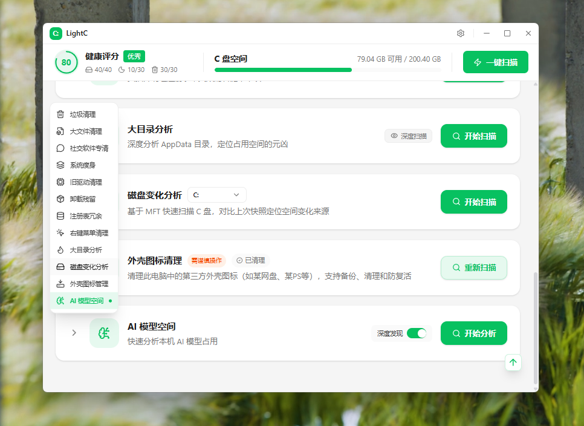

# LightC

LightC is a Windows desktop utility for safe junk cleanup, disk analysis, and system maintenance. It is built with React, TypeScript, Rust, and Tauri.

[简体中文](README.zh-CN.md)

## Features

- **Junk Cleaner** — Quick and deep scans for temporary files, Delivery Optimization files, thumbnails, DirectX shader caches, and selected rebuildable Microsoft Defender caches.
- **Large Files** — Find space-consuming files with drive-aware scanning, risk indicators, selection controls, and safe deletion feedback.
- **Social App Cache** — Review cache categories from WeChat, QQ, DingTalk, Lark, and other supported desktop apps before cleanup.
- **System Slim** — Review optional Windows system components and space-saving settings with clear safety warnings before applying changes, including rebuilding the Windows Search index when Windows.db grows abnormally large.
- **Old Drivers** — Identify unused third-party driver packages while protecting drivers currently in use; supports backup and restore workflows.
- **Uninstall Leftovers** — Detect probable remnants of removed applications across common locations using confidence-based results.
- **Registry Cleanup** — Find orphaned registry references and provide backup-aware cleanup with operation feedback.
- **Context Menu Cleaner** — Review invalid context-menu entries and remove unwanted shell integrations.
- **Directory Analyzer** — Inspect directory space usage, drill into large folders, and clean supported temporary caches.
- **Disk Growth Analysis** — Compare disk snapshots to locate changed files and directories over time.
- **Shell Icons** — Manage third-party This PC shell icons with registry/ACL backup, restore, and anti-respawn protection.
- **AI Model Storage** — Analyze local model, LoRA, embedding, and related cache storage, then remove selected model data.
- **Localization** — Switch between Simplified Chinese, Traditional Chinese, English, and Japanese; module pages, scan stages, settings, and stable backend labels follow the selected language.
## Screenshots

<p align="center">
  
</p>

## Sponsorship

If LightC is useful to you, you are welcome to support its continued maintenance with a voluntary donation. Your support helps fund ongoing development, compatibility work, and issue resolution. LightC remains free to use, and sponsorship does not affect access to features or support priority.

<p align="center">
  
  
</p>

<p align="center"><sub>Scan the corresponding QR code with WeChat or Alipay. Thank you for your support.</sub></p>

## Requirements

- Windows 10 or later.
- Node.js 20.19+ and npm.
- Rust toolchain and the Tauri 2 prerequisites.

## Development

```bash
npm install
npm run dev
npm run build
npm run tauri dev
```

## Portable Mode

Place `LightC.portable.json` beside the executable. LightC then stores its configuration, local data, and WebView data beside the executable instead of the default user profile location.

## Safety Notes

- LightC does not scan or delete the Windows Defender root, quarantine, definition updates, platform data, or other protected Defender data.
- Defender cleanup is limited to the rebuildable `LocalCopy` and `Support` directories.
- System32 cleanup is limited to the explicitly supported DirectX shader cache path.
- Some files require administrator permission or a system reboot and may remain listed as incomplete.
- Review selected items before permanent cleanup and keep important data backed up.

## Reporting Issues

Please search existing issues first, then describe one problem per issue with a clear, factual title. Following the core principles of [How To Ask Questions The Smart Way](https://www.catb.org/esr/faqs/smart-questions.html) helps issues get understood and resolved faster:

- **Bug reports** must include the exact reproduction steps, expected and actual behavior, LightC version, Windows version, selected interface language, and relevant logs or screenshots.
- Include the smallest reproducible example when possible. Redact personal paths, usernames, tokens, and other sensitive information before posting logs or screenshots.
- **Feature requests** should explain the problem and intended outcome, rather than only demanding a specific implementation.
- Keep the discussion concise, respectful, and open to clarification. Please avoid assumptions, insults, or orders; a clear report with useful context is far more effective.
- Low-quality issues (e.g., arrogant questions, pure complaints, no context, no reproduction steps) will not be processed.

## License

See [LICENSE](LICENSE).
